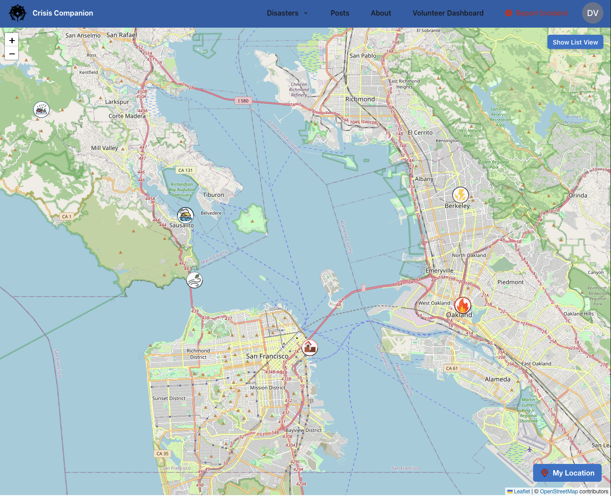
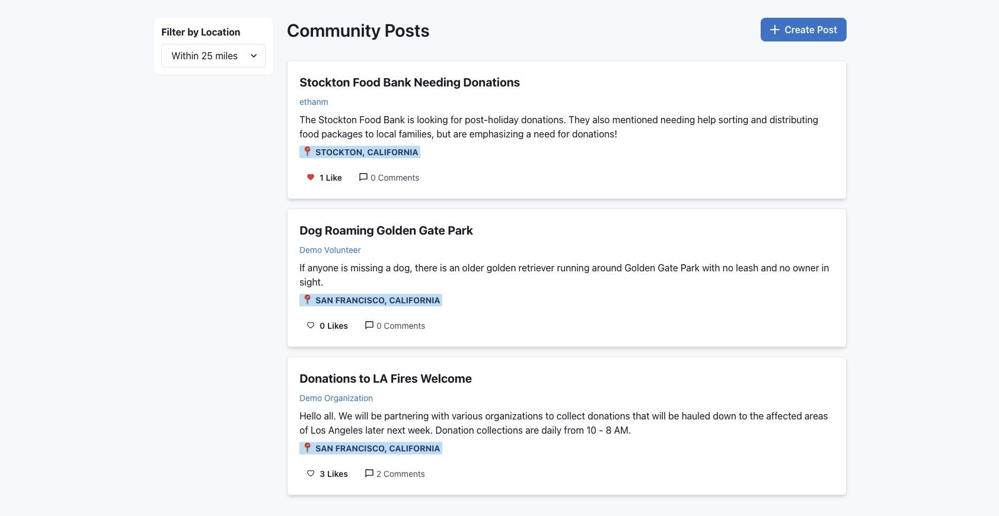
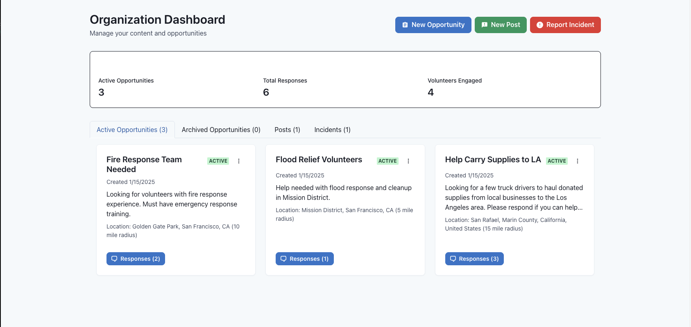
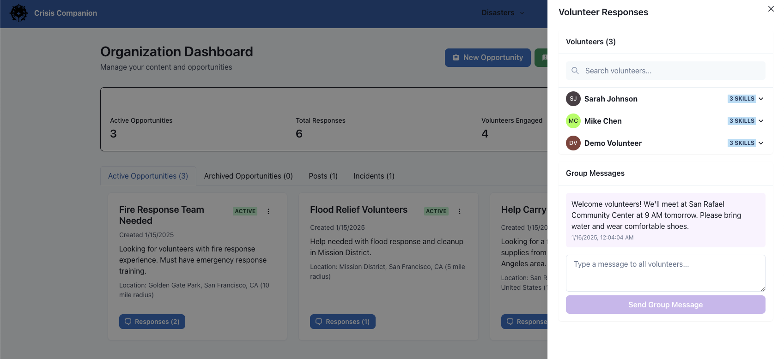
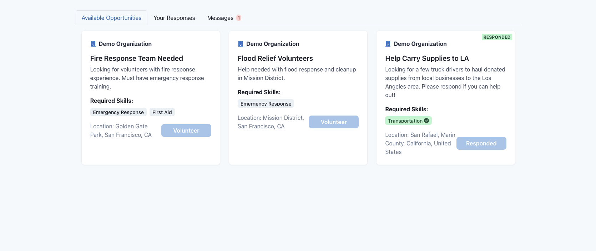

# Crisis Companion

[Insert Project Banner/Logo Image Here]

## Live Demo Access
Visit the live demo at: [Crisis Companion Demo](https://[your-github-username].github.io/crisis-companion)

### Demo Accounts
From the landing page, you can click the "Try Demo Accounts" button, or simply click 'Login' on the header component to be greeted with the
option to choose from a demo 'Organization' account or a demo 'Volunteer' account.


## About Crisis Companion
Crisis Companion is a comprehensive disaster response and community coordination platform that bridges the gap between local organizations, volunteers, and communities during times of crisis. Built with React and powered by Supabase, it provides real-time incident tracking, volunteer coordination, and community communication tools.

[Insert Dashboard Screenshot Here]

## Key Features

### 🗺️ Interactive Incident Map
- Real-time incident visualization and reporting
- Location-based filtering and incident details
- Support for multiple incident types (fires, wildfires, floods, earthquakes, etc.)



### 👥 Community Posts & Engagement
- Location-based community posts
- Real-time commenting and discussion system
- Post filtering by proximity
- Like and interaction features



### 🤝 Volunteer Management System
#### For Organizations:
- Create and manage volunteer opportunities
- Track volunteer responses and applications
- Direct messaging with volunteers
- Analytics dashboard for volunteer engagement
- Opportunity status tracking (active/archived)





#### For Volunteers:
- Skill-based opportunity matching
- Real-time messaging with organizations
- Response tracking and history
- Customizable volunteer profile
- Location-based opportunity discovery



### 📱 Responsive Design
- Fully responsive mobile-first design
- Optimized for all device sizes
- Native-like mobile experience

[Insert Mobile View Screenshot Here]


## Technical Features
- **Frontend**: React.js with Chakra UI
- **Backend**: Supabase (PostgreSQL)
- **Authentication**: Supabase Auth
- **Real-time Updates**: Supabase Real-time subscriptions
- **Mapping**: Leaflet.js integration
- **State Management**: React Hooks
- **Styling**: Chakra UI

## User Guide

### For Organizations
1. **Sign In**: Use the organization demo account
2. **Create Opportunities**: Navigate to the Organization Dashboard
3. **Manage Volunteers**: Track responses and communicate with volunteers
4. **Report Incidents**: Use the incident reporting feature
5. **Post Updates**: Share community updates and announcements

### For Volunteers
1. **Sign In**: Use the volunteer demo account
2. **Browse Opportunities**: Explore available volunteer positions
3. **Apply**: Sign up for opportunities matching your skills
4. **Communicate**: Use the messaging system to coordinate with organizations
5. **Track**: Monitor your volunteer history and engagement

## Local Development
```bash
# Clone the repository
git clone https://github.com/[your-username]/crisis-companion.git

# Install dependencies
cd crisis-companion
npm install

# Start the development server
npm start